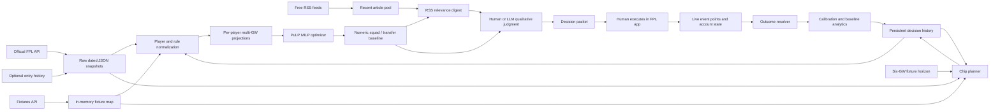

# Data-Driven Workflow and Analytics Architecture

## Executive Summary

This project is best described as a small, file-backed decision-intelligence system for Fantasy Premier League, rather than as an "AI team picker". It combines:

1. Live, keyless FPL data ingestion.
2. Dated raw-data snapshots for reproducibility and historical comparison.
3. Deterministic feature engineering and transparent point projections.
4. Mixed-integer optimization under real FPL constraints.
5. A filtered qualitative-evidence pipeline from free RSS feeds.
6. A human or LLM judgment layer that can confirm, adjust, or veto a numeric recommendation.
7. Persistent squad state and append-only decision logs.
8. Outcome resolution and calibration analytics that compare the judgment layer with the numeric-only baseline.

The central data story is the feedback loop:

> External data -> derived features -> constrained decision -> human execution -> observed outcome -> evaluation -> better future decisions.

The project is intentionally not an end-to-end machine-learning prediction system. The numeric layer is a transparent statistical approximation plus operations research, while the qualitative layer is explicitly kept accountable and human-reviewed. That separation makes it possible to answer the project question: does qualitative judgment add measurable value over a numbers-only optimizer?

## Local Runtime Artifacts

Local runs create the following artifacts under `data/`. They are intentionally excluded from Git because they contain generated snapshots and may include a user's FPL entry ID, squad, decisions, and season state:

| Layer | Local artifact | What it represents |
| --- | --- | --- |
| Raw ingestion | `data/raw/bootstrap_static_<date>.json` | Dated official FPL snapshots |
| Optional account data | `data/raw/entry_<id>_history_<date>.json` | Historical entry totals and ranks |
| Numeric transformation | `data/processed/projections_gw<range>.json` | Multi-gameweek player projections |
| Numeric decision | `data/processed/squad_gw<range>.json` | Optimized 15-player squad, starting XI, bench, captain, and vice-captain |
| Judgment decision | `data/judgment/decision_gw<range>.json` | Final decision packet plus watchlist notes |
| Running state | `data/memory/squad_state.json` | Current squad, bank, free transfers, team value, chip inventory, and state history |
| Weekly audit log | `data/memory/decisions.jsonl` | Recommendation records, including the numeric baseline |
| Chip audit log | `data/memory/chip_decisions.jsonl` | Chip-planning records |

These files can be regenerated from the public FPL API and a locally configured `FPL_ENTRY_ID`. Do not commit them unless they have been deliberately reduced and anonymized as test fixtures.

## End-to-End Data Flow



There are two related operating cadences:

- **Weekly:** refresh data, project the next three gameweeks, optimize the squad or transfer plan, review news, produce a decision packet, and later resolve the result.
- **Every three to four gameweeks:** inspect a six-gameweek fixture horizon and chip inventory to decide whether to hold or play a wildcard, free hit, bench boost, or triple captain.

## 1. Source Data and Ingestion

### Official FPL API

`src/fpl_api.py` is a deliberately thin client around the public FPL API:

- `get_bootstrap_static()` retrieves player records, teams, game settings, scoring rules, events, and chip windows.
- `get_fixtures()` retrieves the fixture schedule and fixture difficulty ratings.
- `get_entry_history(entry_id)` retrieves the user's historical season totals and ranks when an entry ID is available.
- `get_event_live(gw)` retrieves actual per-player points for an event after it has been played.

`src/fetch_bootstrap.py` is the landing step. It writes `bootstrap-static` to a date-stamped file under `data/raw/`. If `FPL_ENTRY_ID` is present, it also writes a date-stamped entry-history file.

The project does not call the official API from a browser, does not require login credentials, and does not use paid sports-data services. This makes the source layer cheap and repeatable, while the dated filenames establish a basic snapshot history.

### The bootstrap data is more than a player table

The pipeline uses the bootstrap response as a data contract for both facts and rules:

- `elements[]`: player IDs, names, clubs, positions, prices, minutes, expected-goal and expected-assist rates, availability, ownership, set-piece order, and historical scoring fields.
- `teams[]`: team IDs, names, and short names.
- `game_settings`: budget, squad size, starting-XI size, position quotas, team limit, and transfer-banking rules.
- `element_types[]`: position-specific squad and starting-XI bounds.
- `game_config.scoring`: the live FPL scoring rulebook.
- `chips[]`: chip names and their usable event windows.
- `events[]`: gameweek metadata, including the `data_checked` finalization flag used before recording outcomes.

One strong data-engineering decision is that scoring rules and squad constraints are read from the API instead of being duplicated as application constants. The projection and optimizer layers therefore adapt when FPL changes a scoring rule or squad rule.

### Fixtures are a separate source

The stored bootstrap snapshot has no fixture records in its top-level `fixtures` field. The running scripts call `/fixtures/` separately through `get_fixtures()`. This is an important lineage detail:

- Player and rule snapshots are persisted.
- Fixture data is currently fetched at run time and passed in memory.
- The exact fixture input used for an old run cannot be reconstructed from the repository unless the upstream API happens to remain unchanged.

### News data

`src/news.py` reads four free RSS feeds:

- BBC football.
- BBC Premier League.
- Fantasy Football Scout.
- Fantasy Football Pundit.

The actual configured feeds include FPL analyst feeds in addition to the BBC and club-news sources described in the project brief. Each RSS item is reduced to `title`, `summary`, `link`, `published`, and `source`.

The ingestion step has three basic quality controls:

- It drops articles older than 14 days by default.
- It deduplicates articles by link, which matters because the two BBC feeds can carry the same story.
- It catches failed feed requests and continues with the feeds that are available.

RSS articles are not currently stored as a raw feed snapshot. They are filtered and printed or passed into the digest in memory. That means news provenance is partially preserved through source links in manual judgment calls, but the complete article pool and the exact feed state at decision time are not archived.

## 2. Normalization and Feature Engineering

`src/projections.py` is the main transformation layer. It turns a current bootstrap snapshot and fixture list into a ranked table of player features and projections.

### Player eligibility

`load_selectable_players()` keeps players whose FPL records have `can_select` set and are not marked `removed`. In the 2026-08-13 snapshot:

- Raw player records: 581.
- Selectable projection records: 563.

This is a real filtering stage, not just a file copy. It ensures removed or non-selectable players do not enter the optimizer.

### Rate conversion and position priors

The source data mixes already-normalized per-90 metrics with cumulative counts. The pipeline:

- Uses existing fields such as expected goals per 90, expected assists per 90, clean sheets per 90, defensive contributions per 90, goals conceded per 90, and saves per 90.
- Converts cumulative fields such as bonus, yellow cards, red cards, own goals, and penalties into per-90 rates using minutes.
- Computes a minutes-weighted average for each rate by position.
- Shrinks low-sample player rates toward their position average. The shrinkage reaches full player weight at 900 minutes.

This is a simple empirical-Bayes-like stabilization step. It prevents a small number of minutes from producing an overly extreme rate, while still allowing players with a reliable sample to retain their own history.

The preseason caveat is material: the cumulative player fields are effectively last season's record before the new season has produced data. New-to-the-Premier-League players have no usable historical sample, so the pipeline applies a neutral starter factor and marks those projections as low confidence.

### Expected minutes and availability

The projection is not based on points alone. It estimates whether a player will be on the pitch:

- Status values such as injured, suspended, unavailable, and not available reduce availability to zero.
- `chance_of_playing_next_round`, when present, is converted into a probability-like availability factor.
- A starter factor uses historical minutes as a proxy for expected involvement.
- Expected minutes are calculated before the points components are scaled.

The model has no full game-by-game rotation model. The availability fields help with known current risk, but rotation caused by a new manager, European congestion, or tactical change remains a qualitative signal for the judgment layer.

### Point decomposition

For each player, `_base_player_points()` produces an explainable per-fixture breakdown:

- Attacking points from expected goals and expected assists.
- Clean-sheet points.
- Goals-conceded points, using the FPL rule that the deduction is applied per two goals conceded.
- Defensive-contribution points, capped at the relevant position threshold.
- Goalkeeper save points, using the saves-per-point ratio.
- Bonus points.
- Discipline and penalty effects.
- Appearance points using a continuous approximation to the FPL appearance step function.

The model pulls most scoring values from `game_config.scoring`. Two rules are kept as constants because they are not exposed as machine-readable values in the public API:

- Defensive-contribution thresholds: 10 for defenders and 12 for midfielders and forwards.
- Three goalkeeper saves per save point.

The resulting breakdown is retained in `breakdown_per_fixture`, so a decision can be explained in terms of attack, clean sheets, bonus, appearance, and other components instead of only showing a black-box total.

### Fixture transformation

`build_fixtures_by_gw_team()` creates this structure:

```text
gameweek -> team -> [(opponent, home_or_away, fixture_difficulty), ...]
```

This representation naturally exposes schedule shape:

- An empty list means a blank gameweek.
- One fixture means a normal gameweek.
- Multiple fixtures mean a double gameweek.

`project_player_horizon()` applies a fixture-difficulty multiplier to each fixture and sums the result over a short horizon. The default is GW1-GW3 rather than a single gameweek because the initial squad is a multi-week commitment. Each projection retains both a horizon total and a per-gameweek breakdown.

The fixture multiplier is a transparent heuristic based on FDR. It is not a learned opponent model, and the same per-fixture player rate is assumed across the horizon. That is appropriate for a baseline, but it is also exactly where a new manager, role change, rotation risk, or tactical adjustment can make the baseline wrong.

### Context features surfaced for judgment

Some data is deliberately kept out of the numeric formula and surfaced as context:

- Set-piece order: penalties, corners or indirect free kicks, and direct free kicks.
- Ownership percentage for differential reporting.
- European competition membership as a rotation-risk flag.
- `low_confidence` for players with no meaningful prior Premier League record.

Set-piece order is not added as a second bonus because last season's attacking rates already include the set pieces that player took. Adding the role again would double count old information. A newly assigned penalty taker is useful precisely because it is a change the old rate cannot see, so it belongs in qualitative review.

The European competition mapping is currently a hardcoded 2026/27 preseason map. It is a useful contextual feature, but not a live competition-status table.

## 3. Numeric Decision Layer

### Initial squad optimization

`src/optimizer.py` uses PuLP with the CBC solver to formulate a mixed-integer linear program. The binary variables represent:

- Whether player `i` belongs to the 15-player squad.
- Whether player `i` starts.
- Whether player `i` is captain.

The optimizer extracts the rules from the bootstrap response and enforces:

- A 15-player squad.
- An 11-player starting XI.
- Position-specific squad counts.
- Position-specific starting bounds.
- A budget in FPL's tenths-of-a-million units.
- A maximum of three players from one club.
- Starting players must be in the squad.
- Exactly one captain, who must start.
- Unavailable players cannot start or be newly purchased.

The objective is intentionally interpretable:

```text
projected points for starters
+ projected points for the captain, as an extra captain multiplier
+ 10% of projected points for bench players
- 2.5 points for each starting attacking player beyond the first from the same club
```

The attacking stack penalty is a heuristic proxy for shared goal-event risk. It is not estimated from joint player-outcome data. The objective also treats the captain as if the same captain were doubled across the whole projection horizon. That is useful for initial squad selection but is only a simplification; actual weekly captaincy is reconsidered in later runs.

### Weekly transfer optimization

`src/transfer.py` reuses the same optimizer in a state-aware mode. It does not rebuild an ideal squad from a blank slate. It receives:

- Current owned player IDs.
- Purchase prices and current prices.
- Bank balance.
- Free transfers.
- Projected player values.

It correctly models the FPL sell-price rule: losses are fully recoverable, while only half of a profit is returned, rounded down in tenths of a million.

The weekly transfer pass sweeps several exact transfer counts and chooses the highest net score:

```text
net score = optimized projected points - 4 * transfers beyond the free allowance
```

It considers at most five transfers and prefers fewer transfers on a tie. This turns the transfer recommendation into an explicit economic decision rather than a list of attractive players.

The same module creates a watchlist of non-owned players ranked by projected points per million and reports whether each target is affordable after selling the cheapest current player in the same position. This is a prescriptive shortlist, not a multi-week transfer plan.

The current repository includes a dry-run entry point, `src/transfer_test.py`, but does not automatically commit transfers or update `squad_state.json`. That is an intentional human-approval boundary.

### Numeric outputs

`src/run_optimizer.py` writes two useful analytical products:

- `projections_gw1-3.json`: the full player-level feature and projection table.
- `squad_gw1-3.json`: the selected squad and decision summary.

In the checked-in GW1-GW3 run:

- Horizon: GW1-GW3.
- Squad cost: 1000 tenths, or £100.0m.
- Starting XI: 11 players.
- Bench: 4 players.
- Captain: B. Fernandes.
- Vice-captain: Gabriel.
- Captain-weighted starting-XI projection: 224.12 points over the horizon.
- Projected player range: 0.00 to 22.79.
- Low-confidence projections: 174.
- Players flagged at clubs in the hardcoded European map: 255.

The captain-weighted total should not be read as a forecast of one gameweek. It is the optimizer's horizon objective with the captain multiplier applied.

## 4. News Evidence and Judgment Layer

### Digest construction

`src/news_digest.py` combines the current squad, the transfer watchlist, team names, and the RSS article pool. It returns:

- Number of articles pulled.
- Feeds that returned content.
- Articles mentioning owned players.
- Articles mentioning watchlist players.
- Articles mentioning owned clubs.
- Articles whose titles or summaries look like FPL strategy content.

The relevance filter is deliberately transparent: it performs case-insensitive substring matching on player or club names. The expert filter uses keywords such as captain, differential, wildcard, gameweek, price rise, predicted lineup, and team news.

This is a lightweight information-retrieval stage. It narrows the evidence set before reasoning, but it is not semantic search, sentiment analysis, or a claim that every relevant article has been found. Surnames, nicknames, spelling variants, and information hidden outside the RSS title or summary can be missed.

### Judgment is a controlled overlay, not a second optimizer

`src/judgment.py` defines the allowed actions:

- `CONFIRM`: keep the numeric selection.
- `ADJUST`: keep the selection but change the confidence or rationale.
- `VETO`: replace a captain with the vice-captain, or replace a starter with the best same-position bench alternative.

The default behavior is important analytically. Every player not covered by an explicit qualitative call receives a default `CONFIRM` with `High` confidence and a stats-only rationale. Therefore, High confidence is intended to mean "no qualitative override was needed," not simply that a person chose the High label.

The layer also preserves:

- The projected points at the time of the call.
- The action and confidence tier.
- A written rationale.
- Source URLs.
- The concrete effect of the call.

This gives the later outcome resolver enough information to test whether the call was useful.

### Current implementation boundary

The digest is automated, but digest-to-judgment mapping is not yet automated:

- `build_digest()` collects current leads and watchlist mentions.
- `judgment_pass.py` still uses a hand-authored `build_calls()` with four named players: B. Fernandes, O'Reilly, Guéhi, and Wirtz.
- The final preseason calls are all `CONFIRM` with `Medium` confidence, supported by manually supplied sources.
- Other squad members receive default `High` stats-only calls.
- The digest is used directly for watchlist notes, while the four manual calls are not dynamically generated from the digest matches.

This distinction is worth explaining when presenting the project. The system has automated evidence collection and controlled decision application, but it does not pretend that keyword matches can safely make injury or rotation judgments on their own.

The current example also illustrates why the layer exists. Bruno Fernandes was selected over Haaland for the particular GW1-GW3 fixture/value tradeoff, while the judgment rationale considered manager context, contract stability, expert previews, and captaincy uncertainty. Wirtz's projected value was checked against a possible positional change under a new manager. Those are data points that a last-season rate table cannot fully represent.

## 5. Persistent State and Data Lineage

`src/memory.py` provides file-backed persistence instead of a database. For a single user and one season, this keeps the system inspectable and easy to reset deliberately.

### Squad state

`data/memory/squad_state.json` is the current state snapshot. It stores:

- Gameweek and optional FPL entry ID.
- The 15 owned players.
- Purchase price for each player.
- Bank balance and team value.
- Current free-transfer count and maximum bankable transfers.
- Each chip's availability, window, and used gameweek.
- A history of state events such as initialization and chip usage.

`init_squad_state()` refuses to overwrite an existing state file. This protects the season history from an accidental re-run of the initial optimizer.

### Weekly decisions

`data/memory/decisions.jsonl` is an append-only decision audit log. Each record keeps the decision and the counterfactual baseline together:

- Gameweek and projection horizon.
- Final captain and vice-captain.
- Final starting-XI IDs.
- Numeric-only captain and starting-XI IDs.
- Full judgment log.
- Resolution status.
- Eventual outcome.

Keeping the baseline in the same record is central to the project. If only the final judgment-adjusted team were saved, it would be impossible to measure whether judgment changed the result.

The current log contains one GW1 record with 15 judgment calls and no outcome yet.

### Chip decisions

`data/memory/chip_decisions.jsonl` stores the slower-cadence chip-planning decisions separately from weekly calls. The current file contains two GW1 records with the same four HOLD calls, written seconds apart. This is evidence that the script is rerunnable, but it also exposes a data-quality issue: there is no run ID or idempotency key to distinguish a deliberate re-evaluation from an accidental duplicate.

### State and lineage gaps

The file-backed design is appropriate for the current scope, but several inputs and transitions are not yet fully lineage-safe:

- Fixture payloads are not saved with each run.
- The complete RSS article pool is not saved with each run.
- There is no input manifest containing source timestamps, configuration, code/model version, or content hashes.
- A same-day bootstrap pull writes the same date-stamped path, so it can overwrite an earlier snapshot from that day.
- Transfer decisions are dry-run only and are not recorded as state transitions.
- There is no implemented function that reconciles actual transfers, team value, or free transfers from the real entry after a deadline.
- The current squad state stores the squad but not the captain; the chip test uses the most expensive squad player as a captain proxy.
- `judgment_pass.py` writes a final judgment artifact, but not the complete digest that led to it.

These are not reasons to reject the architecture. They are the next data-platform improvements needed if the project grows beyond one user and one manually supervised season.

## 6. Outcome Resolution and Analytics

The most important part of the design is that recommendations are intended to resolve against observable outcomes within days, rather than being judged only by how persuasive the rationale sounds.

### Outcome collection

`memory.record_outcome()` is designed to run after FPL finalizes a gameweek:

1. Find the unresolved decision record for the gameweek.
2. Confirm FPL's `events[gw].data_checked` flag unless an explicit force/test path is used.
3. Pull actual per-player points from `get_event_live(gw)`.
4. Score the final decision, the numeric baseline, and the major road-not-taken choices.
5. Write the resolved record back to `decisions.jsonl`.

The finalization gate is a useful operational control. It avoids locking in bonus points while FPL's post-gameweek data is still provisional.

### Decision-level metrics

For each resolved week, the system computes:

- **Judgment-adjusted total:** actual points from the selected starting XI plus the captain's actual points again for the captain multiplier.
- **Baseline total:** the same calculation for the untouched numeric optimizer output.
- **Judgment delta:** judgment-adjusted total minus baseline total.
- **Captain choice delta:** selected captain's actual points minus vice-captain's actual points.
- **Veto delta:** replacement player's actual points minus the vetoed player's actual points, when a veto occurred.
- **Actual versus projection:** whether a called player's actual points met or exceeded the projection recorded at decision time.

This is more informative than looking only at the final rank. It can identify whether value came from squad construction, captaincy, a veto, or simply from the optimizer's original selection.

### Confidence-tier calibration

`compute_calibration()` groups resolved judgment calls into High, Medium, and Low tiers and reports:

- Number of calls.
- Average actual points.
- Rate at which actual points met or exceeded the recorded projection.

The current metric is a checkable hit-rate proxy, not a literal Brier score. A true Brier score would require a probability forecast, such as the estimated probability that a player beats a projection or the probability that a veto is correct. The current confidence labels are ordinal categories, not calibrated probabilities.

The distinction between average points and hit rate is important. A Medium-confidence Haaland call could have a high average simply because Haaland is a strong player. The beat-projection rate better tests whether the confidence category was meaningful relative to the expectation available at the time.

### Season comparison

`compute_season_comparison()` aggregates resolved weeks and reports:

- Cumulative judgment-adjusted points.
- Cumulative numeric-only baseline points.
- Overall delta.
- Number of judgment wins, baseline wins, and ties by gameweek.

This is the project's primary success test. The repository brief also mentions rank, but the current implementation does not calculate a current rank comparison. The optional entry-history artifact contains historical ranks, while current rank and a parallel baseline rank series still need to be wired into the analytics layer.

### What the current numbers say

At the checked-in state:

- Resolved gameweeks: 0.
- Unresolved weekly decisions: 1.
- Weekly judgment calls: 15.
- Chip-planning records: 2, both for GW1.
- Calibration result: correctly expected to report no resolved data.
- Season comparison result: correctly expected to report no resolved data.

This is not a failed analytics system. It means the data collection and evaluation contract exists before the first observation arrives. Once real gameweeks resolve, the same records become a longitudinal experiment.

## 7. Chip-Planning Analytics

The chip planner is a separate long-horizon branch in `src/chip_planner.py`. It does not optimize a weekly XI; it prepares the evidence needed for a manual seasonal resource decision.

### Six-gameweek feature set

For every team in the horizon, `team_fixture_swing()` derives:

- Average fixture difficulty.
- Number of fixtures.
- Gameweeks with no fixture.
- Gameweeks with multiple fixtures.

For the current squad, `squad_gw_fixture_counts()` reports the players who double or blank and the total number of squad fixtures in each gameweek.

The planner deliberately separates two signals:

- Average FDR ease is useful for wildcard timing.
- Fixture count is the relevant signal for bench boost and free hit timing.

A double fixture at an average FDR of 3 and a single fixture at FDR 3 have the same ease score but very different chip value. The code explicitly warns against using the ease score for bench-boost timing.

The planner also surfaces a possible Bench Boost plus Triple Captain stacking week when a squad has extra fixtures and the likely captain's team doubles. It reports the opportunity; it does not automatically play the chips.

### Current chip decision

The preseason run recommends HOLD for the available early chips because:

- There is no blank or double gameweek in the GW1-GW6 window.
- The newly built squad has no immediate structural problem requiring a wildcard.
- The bench is inexpensive cover rather than a bench-boost-ready set of extra fixtures.
- Triple captaincy is held while the captain candidate carries Medium confidence under a new-manager situation.

This is a good example of analytics supporting a decision without pretending that the final strategic choice is a purely numeric output.

## 8. Price and Ownership Side Signals

`src/price_watch.py` is a useful side pipeline, although it is not yet integrated into the weekly decision packet.

- `price_change_risk()` ranks players by same-period net transfer pressure: transfers in minus transfers out. This is a trend signal, not a guarantee of the proprietary nightly FPL price-change result.
- `compare_snapshots()` calculates actual price deltas between two bootstrap snapshots. This is the stronger measurement because it observes the price change directly, but it needs multiple dated snapshots.
- `top_differentials()` ranks highly projected players below an ownership threshold. The optimizer does not optimize for differential ownership because the stated primary metric is points, but the report exposes rank-chasing context without changing the objective.

These signals show the broader analytics potential: the same player table can support expected points, affordability, price risk, ownership strategy, and qualitative review. They are kept as separate views so a rank-chasing preference does not silently contaminate the core points-maximizing baseline.

## 9. Analytics Taxonomy

The repository supports several kinds of analytics at once:

| Analytics type | Example in this project | Decision use |
| --- | --- | --- |
| Descriptive | Player price, minutes, ownership, status, fixture list, squad value | Understand current state |
| Diagnostic | Projection component breakdown, low-confidence flags, judgment rationale, excluded Haaland note | Explain why a recommendation was made |
| Predictive | Multi-GW projected points, expected minutes, FDR-adjusted fixture output, net transfer score | Estimate future player and squad value |
| Prescriptive | MILP squad, captain, transfer count, chip HOLD/PLAY call, bench order | Choose an action under constraints |
| Counterfactual | Captain versus vice-captain, vetoed player versus replacement, judgment versus baseline | Evaluate the road not taken |
| Longitudinal | Decision log, confidence tiers, chip inventory, squad history, team value | Track season trajectory and consistency |
| Operational | API freshness, finalization gate, unavailable statuses, duplicate runs | Keep recommendations timely and auditable |

The most distinctive analytical feature is the counterfactual layer. It does not ask only "did the chosen player score?" It also asks "did the choice beat the alternative that was available at the time?"

## 10. Strengths of the Data Design

### It preserves the baseline

The raw optimizer result is stored alongside the judgment-adjusted result. That enables an honest experiment rather than a post-hoc story about why the final decision was right.

### It separates facts, transformations, and judgment

- API values and rulebook data are inputs.
- Per-90 normalization, availability scaling, and fixture adjustments are deterministic transformations.
- MILP selection is a constrained numeric decision.
- News interpretation and tactical context are explicitly marked as judgment.
- Outcome scoring is separate from recommendation generation.

That separation makes debugging and evaluation much easier.

### It makes reasoning inspectable

A projection keeps its per-gameweek fixtures and component breakdown. A judgment call keeps its rationale and source URLs. A decision record keeps both final and baseline choices. This is strong auditability for a small project.

### It has an early stopping rule

The project does not need to wait until the end of the season to learn whether the concept works. By roughly GW10-GW12 there should be enough resolved calls to see whether the judgment layer has a positive cumulative delta and whether its confidence tiers are behaving differently.

### It treats human approval as a control

The system never logs into or writes to the FPL account. Transfers, chips, and the irreversible final action stay with the user. The pipeline can therefore be tested repeatedly without mutating the real team.

## 11. Current Data Risks and Honest Limitations

These limitations should be included in a technical presentation because they demonstrate a realistic understanding of data quality:

1. **Preseason history bias:** initial player statistics are last-season totals, not current-season observations.
2. **New-player uncertainty:** new or promoted players receive a neutral fallback rather than evidence-based historical rates.
3. **Fixture lineage:** fixtures are fetched live but not saved with the processed projection artifact.
4. **News lineage:** full RSS inputs are not persisted; only selected source links and watchlist notes survive.
5. **Manual judgment coverage:** the digest finds leads, but the current four manual calls are still hardcoded in the judgment pass.
6. **Simple name matching:** nicknames, surname-only articles, spelling variants, and context outside RSS summaries can be missed.
7. **Rotation modeling:** European congestion, manager changes, and tactical roles are surfaced as flags but are not modeled probabilistically.
8. **Hardcoded rule gaps:** defensive-contribution thresholds, save ratios, and the European-club map require manual maintenance.
9. **Projection simplification:** per-90 rates are treated as stable across the horizon and the FDR multiplier is a heuristic.
10. **Stack penalty approximation:** attacking correlation is represented by a fixed penalty, not estimated covariance.
11. **State reconciliation:** transfers, team value, and free transfers are not automatically reconciled from a live entry after execution.
12. **Captain state:** the stored squad has no explicit captain, so the chip test uses a price-based proxy.
13. **Duplicate logging:** chip planning can append repeated records because no run identifier or idempotency key exists.
14. **Calibration definition:** confidence is categorical and the current beat-projection rate is only a Brier-style proxy.
15. **Rank analytics:** current rank versus a baseline is described as a goal but is not yet computed.
16. **No resolved sample:** all current performance analytics are empty by design until a finalized gameweek is recorded.

These constraints define the boundary of the current system: it is a transparent decision pipeline with an evaluation contract, not yet a production data platform or a trained forecasting model.

## 12. How to Present This Project

### Short version

> I built a data-driven FPL decision system that ingests official player, rule, fixture, ownership, and news data; transforms it into explainable multi-gameweek features; solves a constrained squad and transfer optimization problem; overlays human-reviewed qualitative signals; and logs both the recommendation and the numeric-only alternative so the value of judgment can be measured after each gameweek.

### Technical version

> The architecture is a hybrid batch pipeline. Dated official FPL snapshots are the raw layer. A deterministic feature-engineering stage converts mixed cumulative and per-90 player statistics into position-shrunk rates, availability-adjusted expected minutes, fixture-adjusted point components, and contextual flags. PuLP then solves a mixed-integer squad problem under budget, formation, team-limit, availability, transfer, and hit-cost constraints. A separate RSS retrieval stage creates an evidence digest for injuries, manager changes, tactical roles, and FPL previews. Human or LLM judgment can confirm, adjust, or veto the numeric result without inventing an unranked pick. Every decision stores its baseline, rationale, confidence, sources, and later outcome, enabling counterfactual comparison, confidence calibration, and season-level measurement.

### What not to claim

- Do not call it a trained ML prediction model; the current numeric layer is deterministic projection plus optimization.
- Do not claim the judgment layer is fully automated; news retrieval is automated, interpretation is deliberately supervised.
- Do not claim the system has already proven that judgment improves results; no live gameweek is resolved in the checked-in data.
- Do not claim complete reproducibility until fixture and RSS payloads are archived with each run.
- Do not describe rank improvement as measured until the current rank and baseline rank series are implemented.

## 13. Recommended Next Data Improvements

If the goal is to make the data-heavy story stronger while keeping the same product philosophy, the highest-value improvements are:

1. **Create a run manifest:** store run ID, UTC timestamp, source URLs, input file names, horizon, configuration values, and a hash of each raw input.
2. **Persist fixture snapshots:** save the exact `/fixtures/` response beside each bootstrap snapshot.
3. **Persist the news evidence set:** archive normalized RSS items and the filtered digest for every decision deadline.
4. **Add data contracts:** validate required top-level keys, player fields, event IDs, prices, and rule ranges before optimization.
5. **Make decisions idempotent:** use a unique key such as season, gameweek, deadline, and pipeline run ID to prevent duplicate logs.
6. **Reconcile account state:** after the deadline, pull the actual picks and history, record transfers and chips used, and update bank, team value, and free transfers.
7. **Version the decision logic:** store projection constants, code version, and judgment prompt/version with each decision.
8. **Add probabilities:** turn confidence tiers into explicit probabilities so true Brier score and reliability plots become possible.
9. **Build a scorecard:** show judgment points, baseline points, delta, captain delta, veto delta, hit rate by tier, and sample size by gameweek.
10. **Wire rank analytics:** track actual rank and a consistently defined numeric-only counterfactual rank or points proxy.
11. **Make digest coverage measurable:** log which squad and watchlist players were checked, which articles matched, and which matches resulted in a judgment call.
12. **Move from proxy flags to time-varying features:** update European fixtures, probable lineups, manager systems, and set-piece roles as new evidence arrives.

The strongest next step is not a more elaborate optimizer. It is better run-level provenance and the first few finalized outcome records. Those additions would turn the current architecture from a well-designed preseason pipeline into a measurable season-long decision experiment.

## Repository Map

| File | Data responsibility |
| --- | --- |
| [`src/fpl_api.py`](src/fpl_api.py) | Official API client |
| [`src/fetch_bootstrap.py`](src/fetch_bootstrap.py) | Raw snapshot landing |
| [`src/projections.py`](src/projections.py) | Feature engineering and multi-GW projections |
| [`src/optimizer.py`](src/optimizer.py) | Initial squad and transfer-mode MILP |
| [`src/transfer.py`](src/transfer.py) | Transfer-count sweep and target watchlist |
| [`src/news.py`](src/news.py) | RSS ingestion, freshness, deduplication, filtering |
| [`src/news_digest.py`](src/news_digest.py) | Squad, club, watchlist, and expert evidence digest |
| [`src/judgment.py`](src/judgment.py) | Controlled qualitative overlay |
| [`src/judgment_pass.py`](src/judgment_pass.py) | Weekly packet assembly and decision logging |
| [`src/memory.py`](src/memory.py) | Persistent state, outcome resolution, calibration, comparison |
| [`src/chip_planner.py`](src/chip_planner.py) | Six-gameweek fixture and chip analytics |
| [`src/price_watch.py`](src/price_watch.py) | Price-pressure and snapshot-delta signals |
| [`src/run_optimizer.py`](src/run_optimizer.py) | Numeric baseline entry point |
| [`src/init_season_state.py`](src/init_season_state.py) | Initial state creation |
| [`src/transfer_test.py`](src/transfer_test.py) | Weekly transfer dry run |
| [`src/chip_planner_test.py`](src/chip_planner_test.py) | Preseason chip-planner run |
| [`README.md`](README.md) | Product behavior and current status |
| [`CLAUDE.md`](CLAUDE.md) | Project brief, success metrics, and build order |
