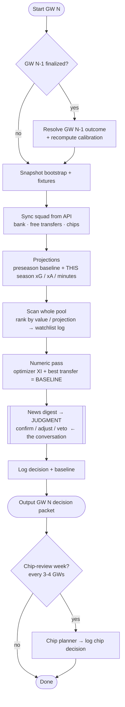

# Gameweek Workflow

How a single gameweek is run end-to-end — the repeatable process, and the plan to automate it
so each week becomes **one command plus one judgment call** instead of a pile of manual steps.

> **Status: design / plan.** The building blocks exist as separate modules today; the orchestrator
> and the in-season projection upgrade below are **not built yet**. Target: before **GW4 (Sat 12 Sep 2026)**.

## The loop

Only the **Judgment** step needs a human/LLM in the loop. Everything else is deterministic plumbing
that `run_gw.py N` will run automatically — including resolving the previous gameweek and recomputing
calibration — so logging and calibration never have to be done by hand mid-conversation.

## Weekly steps (each GW N)

1. **Resolve previous** — if GW N-1 is finalized (`events[N-1].data_checked`), record its actual
   outcome and recompute calibration + season-vs-baseline.
2. **Snapshot** — pull fresh `bootstrap-static` + `fixtures`, date-stamped into `data/raw/`.
3. **Sync squad** — pull real picks, bank, free transfers, and chip inventory from the FPL API into
   `squad_state.json` (no more stale state).
4. **Project** — expected points per player across the horizon, from underlying stats.
5. **Scan** — rank the *whole* player pool by value/projection; log a timestamped watchlist. Never
   limit analysis to a named shortlist.
6. **Numeric pass** — the optimizer's best XI + best transfer within free-transfer/budget limits.
   This is the **baseline** the judgment layer is scored against.
7. **Judgment** — news digest → confirm / adjust / veto, each with a confidence tier. *(This is the
   part we actually discuss.)*
8. **Log** — write the decision + the baseline to `decisions.jsonl`.
9. **Output** — the GW decision packet (transfer, captain, chip, bench order).

## Chip cadence (every 3–4 GWs)

A separate, lower-frequency pass: the chip planner reviews wildcard / bench-boost / triple-captain /
free-hit timing over the next ~6 GWs against fixture swings and remaining chip inventory, and logs to
`chip_decisions.jsonl`.

## Code to build (before GW4)

| Change | File | Status | Why |
|---|---|---|---|
| **Blend in-season xG/xA/minutes** into projections (weighted by games played) | `projections.py` | enhance | ⭐ the real "recent stats" upgrade — today it still runs on *last season's* rates |
| `get_element_summary()`, `get_entry_picks()` | `fpl_api.py` | new | per-GW history + real squad (both missing) |
| Recent-form trend helper (last N GWs: mins, xGI, points) | `recent_form.py` | new | hot/cold + rotation signal for scan + judgment |
| Full-pool scan → watchlist log | `scan.py` | new | codifies "scan first"; uses real projections, not FPL's opaque `ep_next` |
| Sync entry picks/bank/FTs → state | `squad_sync.py` | new | kills the stale-state bug |
| **Orchestrator** `run_gw.py N` chains all auto-steps | `run_gw.py` | new | the "don't do it manually" piece |
| optimizer · transfer · news_digest · judgment_pass · memory · chip_planner | *(existing)* | reuse | already built — just orchestrate |

### The one that matters most

`projections.py` still runs on last season's / preseason rates. Two gameweeks in, the highest-value
change is blending **this** season's xG/xA/minutes into the projection (priors early, live data as the
sample grows). That's what turns "look at recent stats" into the numbers the scan and optimizer use.
